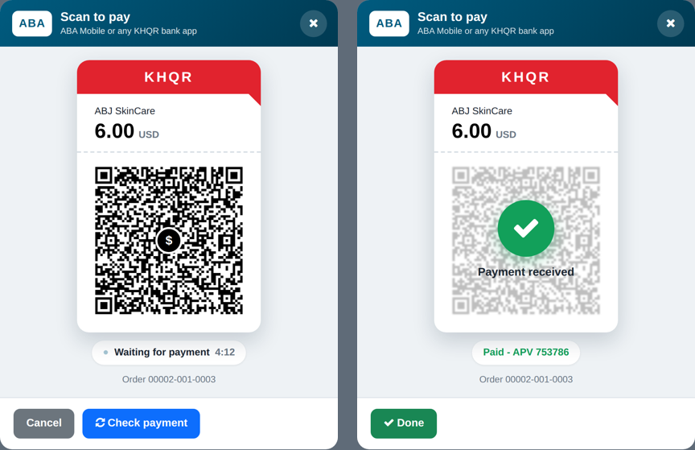

# ABA KHQR for Point of Sale (Odoo 18)

Customers scan a **KHQR** on the POS screen — or on the customer-facing
display when the till has a second screen — with ABA Mobile (or ACLEDA, Wing,
Bakong… any KHQR app). With ABA PayWay the payment is confirmed automatically
and the order validates by itself.



## What was wrong ("Style error" in the POS)

The POS stylesheet failed to compile right after `pos_aba_khqr` 18.0.1.0.0 was
installed. The error stored in the broken bundle is:

```
Internal Error: Incompatible units: 'vw' and 'px'.
```

Odoo compiles SCSS with **libsass**, which treats CSS `min()` / `max()` as Sass
math. A rule like `width: min(90vw, 420px)` therefore crashes the *whole*
`point_of_sale` stylesheet, and Odoo falls back to the old CSS with that red
banner. This version uses no `min()`/`max()` (it uses `width` + `max-width`)
and was compiled with libsass to check it.

A second problem: the **"ABA QR Online"** method is Odoo's *online payment* type.
Its QR is a **web link** to a checkout page, not a KHQR, so the ABA app's
scanner can't pay it directly. This module shows a real KHQR instead.

## Two ways to get the QR

| | ABA PayWay (recommended) | My own KHQR |
|---|---|---|
| QR comes from | PayWay QR API (`generate-qr`) | Your shop's ABA KHQR / Bakong ID |
| Payment confirmed | Automatically (status check + webhook) | Cashier presses **Payment received** |
| Needs | PayWay merchant ID + API key with **QR API enabled** | Nothing else |
| Fraud risk | None from screenshots | Cashier must check the ABA app |

## Install / upgrade (replace the old module)

1. **Delete the old `pos_aba_khqr` folder** on the server first. If you copy
   the new files over it, the old broken `.scss` stays and the error stays,
   because the manifest loads `static/src/**/*`.
2. Copy `addons/pos_aba_khqr` into your addons path.
3. Restart Odoo, then **Apps → ABA KHQR for Point of Sale → Upgrade**
   (or `odoo -u pos_aba_khqr -d <db>`).
4. Reload the POS with `Ctrl+Shift+R`. The red "css error" banner is gone.
5. Reload the **customer display** page too (it has its own asset bundle).

The upgrade keeps the existing fields (`aba_khqr_provider_id`,
`aba_khqr_lifetime`, `aba_khqr_template`, `aba_khqr_webhook_url`) and the
`pos.aba.khqr.request` model, so no data is lost.

## Configure

**Point of Sale → Configuration → Payment Methods → "QR ABA"** (or a new one):

* **Journal**: `ABA Bank` (a *bank* journal)
* **Integration**: `Terminal` → **Integrate with**: `ABA KHQR`
* **KHQR source**: `ABA PayWay` → **ABA PayWay provider**: `ABA KHQR`
* **QR lifetime**: 5 minutes (PayWay minimum is 3)
* Optional: upload the ABA logo in the method's image; the popup shows it.

Then in **BOOTH SHOP → Payment methods**, add this method and remove
"ABA QR Online". Keep **Automatically validate order** on.

**ABA PayWay checklist**
* Ask ABA (PayWay support) to enable the **QR API** on your merchant ID and, if
  they require it, to whitelist your server IP / domain.
* Optionally give them the **Webhook URL** shown on the payment method
  (`https://abjskincare.com/pos/aba_khqr/webhook`). Without it the POS still
  polls PayWay every 3 seconds; with it, confirmation is instant.
* Test first with the provider in **Sandbox** and a $0.01 payment.

**Own KHQR mode**: scan your shop's ABA KHQR sticker with any QR reader (Google
Lens, etc.), copy the text that starts with `000201` and paste it into **Your
KHQR text or Bakong ID**. The module keeps the bank's account data and only
adds the amount, the order reference and a 5-minute expiry.

## At the till

1. Cashier taps **QR ABA** on the payment screen; the KHQR popup opens with
   the amount and a countdown.
2. The customer scans and pays in their bank app.
3. PayWay mode: the popup turns green ("Paid – APV 123456") and the order
   validates. Own-KHQR mode: the cashier checks the ABA app, taps **Payment
   received** → **Yes, received**.
4. **New QR** if it expired; **Cancel** to choose another method. Cancelling
   first re-checks ABA, so a last-second payment is never lost.

## Customer display (second screen)

Some tills have two screens: the cashier's POS and a **customer-facing
display** (Point of Sale → Settings → *Customer Display*, the page at
`/pos_customer_display/<config>/<token>`). While the cashier's KHQR popup is
open, the **same KHQR is shown full-size on the customer display** — the
customer scans from their side of the counter and never has to read the
cashier's screen.

* Appears the moment the cashier taps the method ("Preparing your KHQR…"),
  then shows the KHQR card, the amount, a Khmer/English *Waiting for payment*
  line and the countdown.
* Turns green — *បានទទួលប្រាក់ / Payment received / Thank you* — when PayWay
  confirms (or the cashier confirms in own-KHQR mode), stays a moment, then
  the display goes back to the order / thank-you screen.
* Cancel on the POS takes it off the display at once; an expired QR shows
  "QR expired" until the cashier presses **New QR**.
* Nothing changes on a single-screen / handheld POS: the cashier's popup is
  still the QR the customer scans. The display only receives data when the
  POS has a customer display configured.

Technical: the POS adds an `abaKhqr` block to the data it already streams to
the display (`getCustomerDisplayData`), and a small patch of the display
opens/closes a dialog on it. Local (same device) and remote (other device)
display types both work; the countdown is re-anchored on every message, so
the two devices' clocks don't need to agree. Styling lives in
`static/src/customer_display/` and is loaded only in the display bundle.

## Back office

**Point of Sale → Orders → ABA KHQR Payments** lists every QR with its
status, APV and the POS order it paid. The **Needs attention** filter shows:

* **Paid after cancel/expiry**: the customer paid a QR the cashier had
  cancelled. Refund them or register the payment on the order by hand.
* **Amount mismatch**: ABA reports a different amount.

A cron (every 10 min) expires old QR codes and re-checks recently cancelled
ones with PayWay to catch such late payments.

## Technical notes

* `tools/khqr.py`: KHQR encoder, output identical to the official NBC
  `bakong-khqr` SDK (tests include SDK-generated vectors). Dynamic QR codes
  carry tag 99 creation + expiry timestamps as KHQR requires.
* `tools/payway.py`: PayWay QR API client (`generate-qr`,
  `check-transaction-2`, `close-transaction`), HMAC-SHA512 signing.
* The webhook body is never trusted: it only triggers a `check-transaction-2`.
* QR is rendered server-side with error-correction level Q so the currency
  mark in the centre doesn't affect scanning.
* Tests: `odoo -d <db> -u pos_aba_khqr --test-tags /pos_aba_khqr --stop-after-init`
